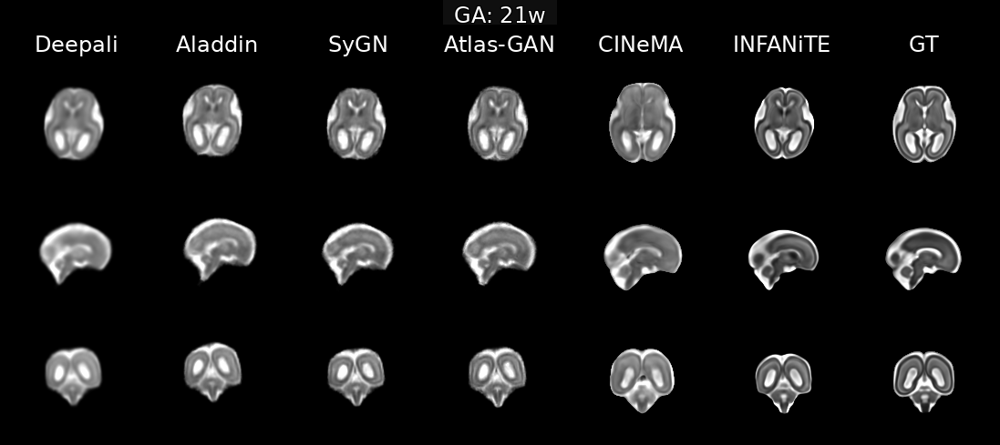
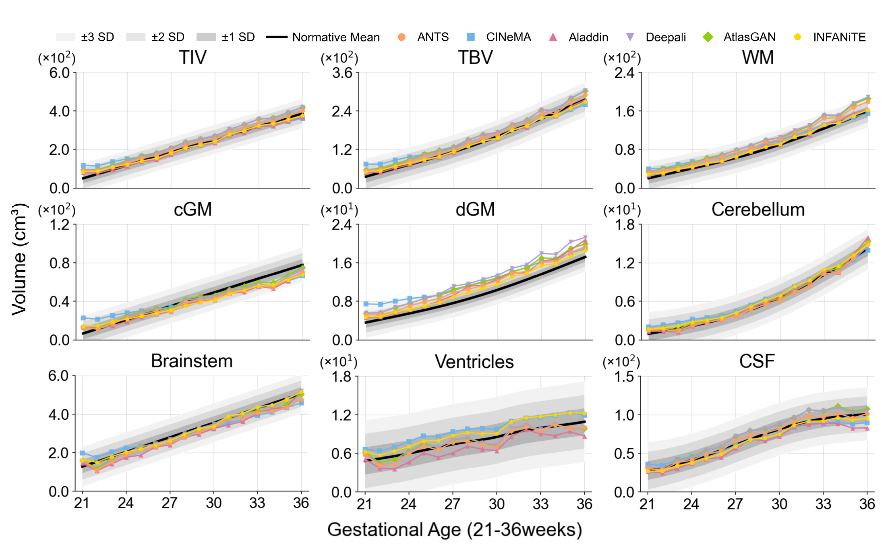
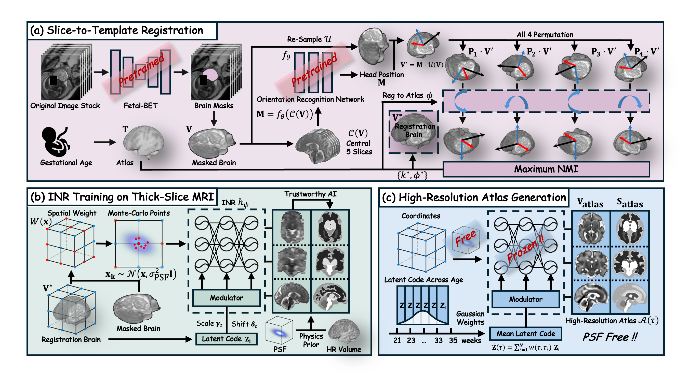

# 🫄 INFANiTE: Implicit Neural representation for high-resolution Fetal brain spatio-temporal Atlas learNing from clinical Thick-slicE MRI

<p align="center">
  
</p>
<p align="center">
  <i><b>Figure 1.</b> Visual comparison of INFANiTE vs. representative baselines across gestational ages (axial / sagittal / coronal).</i>
</p>

<p align="center">
  
</p>
<p align="center">
  <i><b>Figure 2.</b> Atlas-derived tissue-volume trajectories compared with normative models (mean with ±1–3 SD bands).</i>
</p>

---

## 📝 Overview

INFANiTE is a physics-informed Implicit Neural Representation (INR) framework designed to build high-resolution spatio-temporal fetal brain atlases directly from clinical thick-slice MRI. By unifying reconstruction and atlas construction into a single learning paradigm, it avoids multi-stage pipelines that rely on intermediate 3D volumes.  The result is fast generation of sharp, biologically plausible atlases suitable for population-level analysis.

<p align="center">
  
</p>
<p align="center">
  <i><b>Figure 3.</b> Overview of the proposed framework INFANiTE.</i>

The framework consists of three main stages:

- (a) Slice-to-Template Registration  
  Raw thick-slice stacks are rigidly aligned into a common coordinate space (atlas space).

- (b) INR Training  
  An INR network is trained to map 3D coordinates → intensities, incorporating PSF modeling and spatial weighting to recover sharp anatomical details directly from the aligned slices.

- (c) Atlas Generation  
  The trained network is queried without PSF simulation (PSF-free inference) at arbitrary coordinates to reconstruct the final high-resolution 3D atlas.

---

## ✨ Key Innovations

- 🎞️ Direct Thick-Slice Registration  
  Aligns raw thick-slice stacks directly in atlas space, bypassing SVR and avoiding reconstruction-induced artifacts.

- 🧠 Physics-Informed PSF Modeling  
  Incorporates Point Spread Function (PSF) and a spatially-weighted optimization objective to recover sharp anatomical details despite low through-plane resolution.

- 🚀 End-to-End Acceleration  
  Removes SVR and iterative groupwise registration, cutting runtime from days to hours.

- 💪 Robustness & Fidelity  
  Outperforms strong baselines (e.g., SyGN, CINeMA) in consistency and quality, and remains reliable under sparse inputs (e.g., single-stack).

---

## 🚀 Usage

### Environment

```bash
conda create -n INFANiTE python=3.10 -y
conda activate INFANiTE
pip install -r requirements.txt
````

### Data Preparation

Step 1: Slice-to-Template Registration 
You first need to perform slice-to-template registration to obtain aligned, isotropic thick-slice volumes in NIfTI format (*.nii.gz).  
**Registration code is coming soon.** Assuming you already have the aligned thick-slice volumes and segmentations:

Step 2: Build a spatial weighting map W(x)  
Construct the spatial weighting map W(x) following the idea in **`spatial_weighting.py`**. **See `spatial_weighting.py` for full details.**
Expected outputs (examples)
```bash
spatial_weighting/
├── 1160_201_mask_sample.nii.gz
├── 1160_501_mask_sample.nii.gz
├── 1283_1601_mask_sample.nii.gz
└── ...
````
Here, 1160 / 1283 is the subject_id, and 201 / 501 / 1601 indicate different stack orientations.
configure the dataset via:
* configs/subject_ids.yaml
* configs/fetal.tsv

1. Split train subjects in configs/subject_ids.yaml (example)

```yaml
fetal_atlas:
  subject_ids:
    train:
      - "24_0001_602"
      - "35_0003_502"
````

Explanation: in 24_0001_602, 24 is the gestational age (weeks), 0001 is the subject_id, and 602 indicates one stack orientation.

2. Fill scan metadata and file paths in configs/fetal.tsv (example)

```tsv
subject_id	scan_age	T2w	Seg
24_0001_502	24.0	./thickslices/24_0001_502.nii.gz	./thickslices_seg/24_0001_502_seg.nii.gz
```

Notes

* subject_ids.yaml IDs must match the subject_id column in fetal.tsv.
* scan_age is gestational age (weeks).
* T2w should point to the aligned isotropic thick-slice volume.

### Experiment Settings

Training hyperparameters and other settings can be configured in:

* configs/config_atlas.yaml

  Example edits:

  ```yaml
  n_subjects: 
    train: 600
  epochs: 
    train: 5
  spatial_weighting:
    path: ./spatial_weighting
    w_obs: 1.6
    w_int: 0.8
  ```

* configs/config_data.yaml

  Example edits:

  ```yaml
  subject_ids: ./configs/subject_ids.yaml
  tsv_file: ./configs/fetal.tsv
  ```

---


## 🧪 Training and atlas generation

```bash
python run.py
```

---

## 📊 Results

P1. Image quality on Multi-Stack / Single-Stack datasets. **Bold**: best. <ins>Underline</ins>: runner-up

Metrics: subject consistency (HD95, ASD, DSC), intrinsic quality (TCT), reference fidelity (PSNR/SSIM against test subjects: subscript r; pseudo GT atlas: subscript a).

Multi-Stack dataset:

|   Method  |  HD95  |   ASD  |   DSC  |   TCT  |  PSNRr  |  SSIMr |  PSNRa  |  SSIMa |
| :-------: | :----: | :----: | :----: | :----: | :-----: | :----: | :-----: | :----: |
|  Deepali  | 3.2413 | 1.1774 | 0.7149 | 0.2627 | 11.9634 | 0.3558 | 13.5951 | 0.4091 |
| Atlas-GAN | 2.9080 | 1.0854 | 0.7348 | 0.1590 | 12.9860 | 0.4926 | 16.1068 | 0.6228 |
|    SyGN   | 2.8669 | 1.0661 | 0.7395 | 0.1330 | 13.1003 | 0.4983 | 16.2402 | 0.6138 |
|  Aladdin  | 2.6061 | 0.9322 | 0.7711 | 0.5650 | 12.8262 | 0.4629 | 15.6580 | 0.5674 |
|   CINeMA  | <ins>2.4137</ins> | <ins>0.8766</ins> | <ins>0.7849</ins> | **1.0133** | <ins>15.0291</ins> | <ins>0.5091</ins> | <ins>19.5325</ins> | <ins>0.7073</ins> |
|  INFANiTE | **2.3572** | **0.8552** | **0.7865** | <ins>0.9702</ins> | **18.4754** | **0.5662** | **22.3165** | **0.7854** |

Single-Stack dataset:

|   Method  |  HD95  |   ASD  |   DSC  |   TCT  |  PSNRr  |  SSIMr |  PSNRa  |  SSIMa |
| :-------: | :----: | :----: | :----: | :----: | :-----: | :----: | :-----: | :----: |
|  Deepali  | 3.2914 | 1.2065 | 0.7013 | 0.2794 | 12.5151 | 0.3692 | 14.1211 | 0.4239 |
| Atlas-GAN | 3.0763 | 1.1366 | 0.7191 | 0.1638 | 14.1648 | <ins>0.4958</ins> | 17.1474 | 0.6233 |
|    SyGN   | 3.0873 | 1.1406 | 0.7175 | 0.1556 | 13.9070 | 0.4821 | 16.7512 | 0.5869 |
|  Aladdin  | <ins>2.7356</ins> | <ins>0.9733</ins> | 0.7536 | 0.5226 | 12.7240 | 0.4424 | 15.2615 | 0.5307 |
|   CINeMA  | 2.7548 | 0.9860 | <ins>0.7663</ins> | **0.9308** | <ins>14.2107</ins> | 0.4859 | <ins>18.0846</ins> | <ins>0.6507</ins> |
|  INFANiTE | **2.5394** | **0.9153** | **0.7721** | <ins>0.8143</ins> | **18.4786** | **0.5533** | **21.6521** | **0.7593** |

P2. Biological plausibility (Multi-Stack dataset). **Bold**: best. <ins>Underline</ins>: runner-up

Reported as L1 error (cm³) between atlas-derived tissue volumes and normative developmental trajectories.

|   Method  |   TBV   |    WM   |   BS   |   cGM  |   dGM  |   CSF  | Cereb. |  Vent. |
| :-------: | :-----: | :-----: | :----: | :----: | :----: | :----: | :----: | :----: |
|  Deepali  | 17.1868 | 17.0883 | <ins>0.1136</ins> | <ins>4.0106</ins> | 2.9608 | 6.9662 | **0.2937** | 0.7056 |
| Atlas-GAN | 18.2885 | 16.8882 | 0.1418 | **3.3539** | 2.4323 | 7.4958 | 0.3503 | <ins>0.6559</ins> |
|    SyGN   | 10.4882 | 12.7053 | 0.2587 | 4.6551 | 1.8042 | **2.8200** | <ins>0.3089</ins> | **0.6250** |
|  Aladdin  | **4.2071** | <ins>4.2575</ins> | 0.3199 | 5.8404 | <ins>1.7586</ins> | 6.8455 | 0.3943 | 1.1958 |
|   CINeMA  | 15.3309 | 9.3550 | 0.2904 | 6.8382 | 2.6446 | 4.8110 | 0.6120 | 1.6866 |
|  INFANiTE | <ins>4.9467</ins> | **3.7115** | **0.0941** | 5.6733 | **1.1852** | <ins>3.0104</ins> | 0.4880 | 1.3119 |

## Implementation Details

We implemented **INFANiTE** in PyTorch and trained the model on a single **NVIDIA H100 GPU (80GB)** for **5 epochs** with a subject batch size of **250**. For each iteration, we sampled **18,000** 3D coordinates and used **16** dataloader workers. The implicit decoder was a **SIREN** MLP with hidden size **1024** and **5** hidden layers, modulated by a latent code of dimension $[256,3,3,3]$ at layers $\{1,3,5\}$ with $\omega=(30,30)$. To model acquisition blur, we apply a PSF-based Monte Carlo averaging by querying the decoder at Gaussian-perturbed coordinates and averaging the predictions; we set $P=4$ (epoch 0), $P=8$ (epoch 1), and $P=16$ (epochs $\ge 2$), with $\sigma=(0.02,0.02,0.02)$. We generated isotropic atlases at **0.8 mm** spacing across gestational ages **21–39 weeks**.

## 🙏 Acknowledgments

We gratefully acknowledge the contributions of the following projects:

CINeMA: [https://github.com/m-dannecker/CINeMA](https://github.com/m-dannecker/CINeMA)

CMR representations: [https://github.com/NILOIDE/CMR_representations](https://github.com/NILOIDE/CMR_representations)
